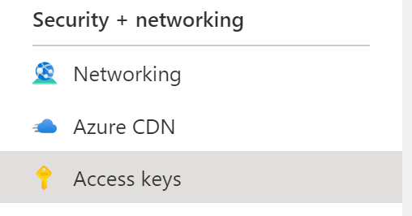
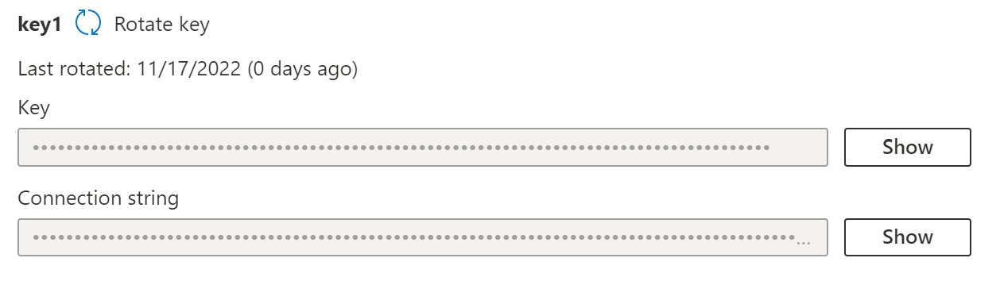

# Deploying Votesy!
The fun part of this app is deploying it! We have options to deploy the application into the following infrastructure:

* Locally using docker compose.
* Azure Kubernetes Service (AKS)
* Azure Container Apps

### Step 1, lets connect to our Azure Subscription.
az login
az account set --subscription "subsciption name"

### Step 2, regardless of which method we choose, we need to create a storage account in the resource group.
Run the following command:
```
az deployment group create --resource-group rg-votesy --template-file storage.bicep
```

When the command prompts for a location, type in the preferred location.
🚀 If planning on deploying into Azure Container Apps, or Azure Azure Kubernetes Service, ideally choose **eastus2**.

```
Please provide string value for 'location' (? for help):
```

## Instructions for Docker Compose

With the new storage account created, you will need to get the connection string, and the key from the "🔑 Access Keys" section. Add these elements into the .env file.




```
KEY=""
STORAGE_CONNECTION_STRING=""
```

Then execute the following command:

```
docker compose --file docker-compose.yml --env-file .env up
```

Once everything is up (and provided there are no errors) navigate to...

```
http://localhost:5002/
```
...to see the site in action.

When you're done, run this command to bring everything down:

```
docker compose --file docker-compose.yml --env-file .env down

```

## Instructions for Azure Container Apps

We want to make sure we are deploying everything into the same resource group, and in a region that supports Azure Container Apps. As of the time of this writing, it's not available in every region. [Check here](https://azure.microsoft.com/en-us/explore/global-infrastructure/products-by-region/?products=container-apps) for the current regions. Right now, we are going to focus creating everything in **eastus2**.

Running the following command will get things going, creating us a resource group, a storage account, and a container registry. Make note of the name of the new container registry.

```
az deployment create --template-file supporting-infra.bicep --location eastus2
```

Now, we can build and push the container images to the registry. From the Infrastructure folder, run these commands:

```
$env:REGISTRY = "<registry_name>" 

az acr build -f ../votesy-api/Dockerfile -t votesy-api -r $env:REGISTRY ../votesy-api
az acr build -f ../votesy-web/Dockerfile -t votesy-web -r $env:REGISTRY ../votesy-web
az acr build -f ../Votesy.Results/Dockerfile -t votesy-results -r $env:REGISTRY ../Votesy.Results
az acr build -f ../Votesy.Service/Dockerfile -t votesy-service -r $env:REGISTRY ../Votesy.Service
```

With these images in the registry, it's time to create the container app.

$env:ACRUSER=$(az acr credential show -n $env:REGISTRY --query username -o tsv)
$env:ACRPASSWORD=$(az acr credential show -n $env:REGISTRY --query "passwords[0].value" -o tsv)

$env:CONNECTIONSTRING = "<connection_string>"
$env:KEY = "<key>"
$env:STORAGENAME ="<name_of_storage_account>"

az deployment group create -n container-app -g rg-votesy --template-file ./container-app-main.bicep -p registry=<registry_name> registryUsername=$env:ACRUSER registryPassword=$env:ACRPASSWORD storageConnectionString=$env:CONNECTIONSTRING storageKey=$env:KEY storageName=$env:STORAGENAME

## Instructions for Azure Kubernetes Service